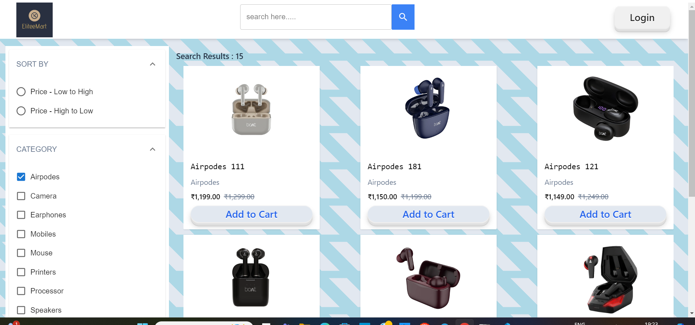

# EliteeMart

    An e-commerce platform with a variety of electronic products, including the latest gadgets and accessories, offering a seamless user experience and a wide range of options to choose from.

## Website : [Visit Elite Emart](https://eliteemart.netlify.app)


The platform features two distinct roles: **User and Admin.**   

# 🎯 Project Overview
- **Admin Role:** Full access to manage products, upload new items, and perform purchases.


- **User Role:** Browse and purchase products, with the ability to filter, search, and view detailed product information.


## 🔑 Admin Test Credentials

To explore the Admin role, use the following credentials:

- **Username:** `test1234`
- **Password:** `test1234`


**For Product Display:**
 - ***Fetch Product Data:*** Retrieves product data from a custom-built Node.js and MongoDB API

 - **Responsive Product Grid:** Displays products in a grid format using React, with each product card showing the product image, title, and price

 

-------------------------------------------------------------------------


**Search Functionality:**

- **Search Bar:** Allows users to search products by name.

- **Dynamic Filtering:** The search results dynamically update and display relevant products as the user types


-------------------------------------------------------------------------

**Category Filters:**
- **Interactive Category Filter:** Users can filter products by clicking on categories below the search bar to view products specific to that category 




**Product Modal:**
- **Detailed Product Information:** Clicking on a product opens a modal with detailed product information to help users make informed purchase decisions

- 


# Setup Instructions

## Prerequisites
- Node.js and npm installed on your machine.
- MongoDB (cloud-hosted MongoDB Atlas or local installation).

## Backend Setup
1. Clone the backend repository and navigate to the project directory.

   ```bash
   git clone <https://github.com/techiemow/Elite-Emart-Backend>
   cd eliteemart-backend

2. Install dependencies
    ```bash
    npm install
 
 3. Create a .env file in the root directory and add your MongoDB connection string and any other environment variables.
     ```bash
     MONGO_URI=<your-mongodb-uri>
     JWT_SECRET=<your-jwt-secret>
     NODE_ENV = "production"
     FRONTEND_URL=<your-frontend-url>
     RAZORPAY_KEY_ID = <RAZORPAY_KEY_ID>
     RAZORPAY_KEY_SECRECT = <RAZORPAY_KEY_SECRECT>
 4. Start the server
     ```bash
      node index.js

## Front-end Setup
1. Clone the backend repository and navigate to the project directory.

   ```bash
   git clone <https://github.com/techiemow/Elite-Emart>

   cd eliteemart

2. Install dependencies
    ```bash
    npm install

3. Start the React development server
    ```bash
    npm run dev

⚙️ **Usage Guidelines**

### Admin Actions:
- Log in with the Admin credentials to add or remove products and view all orders.
- Use the Admin Dashboard to update product details.

### User Actions:
- Browse the product catalog, search, filter by category, and view product details in the modal.
- Add products to the cart and proceed to checkout.


🌟 **Additional Value-Adding Features (Suggested Enhancements)**
- To expand on this project, consider implementing the following features:


- **MyProfile page**: A MyProfile page has been created to see all the details about the user

- **Order History**: Create a section where users can view their past orders and track their current order's payment status etc.

