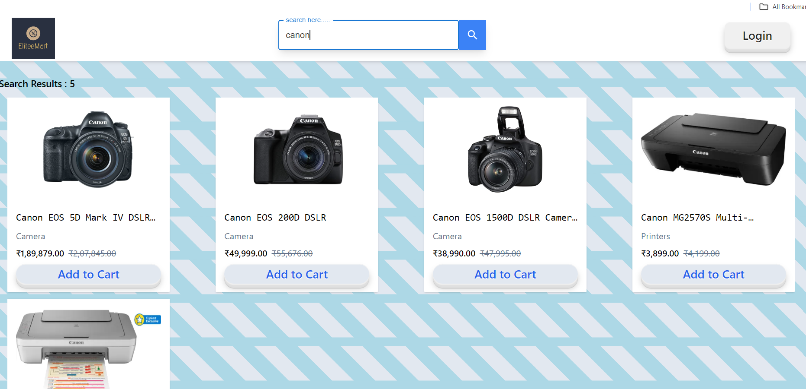

# EliteeMart

    An e-commerce platform with a variety of electronic products, including the latest gadgets and accessories, offering a seamless user experience and a wide range of options to choose from.

The platform features two distinct roles: **User and Admin.**

- Admin: Has full access to upload and manage products, as well as make purchases.

- User: Can browse and purchase products.

 **For testing the Admin role, use the following credentials:**

- Username: test1234
- Password: test1234

**For Product Display:**
 - Fetchs product data from your custom-built Node.js and MongoDB API.

 - Display products in a responsive grid format using React.
 - Each product card should show the product image, title, and price.

 

**Search Functionality:**

- Provide a search bar that allows users to search products by name.

- The search results should dynamically filter and display relevant products as the
user types.

**Category Filters:**
- Here onclick of categories below the search bar can go the category filter section 

**Product Modal:**
- When a product is clicked, open a modal displaying detailed product information

- 